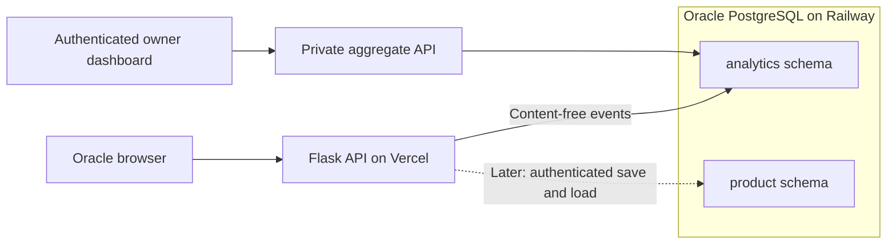

# Oracle database implementation plan

Prepared September 29, 2026; status updated September 30. The analytics foundation
is live on Railway and Vercel, with scoped roles, verified TLS, tested snapshot
recovery, and daily retention. The private owner dashboard is implemented and
locally verified; Google OAuth setup and owner enrollment remain before release.
This document defines the
database work order; [DASHBOARD_PLAN.md](DASHBOARD_PLAN.md) contains the fuller
metric definitions, dashboard design, and product privacy contracts.

The first slice includes migrations, strict event validation, scoped database
roles, the optional database sink, milestone writes, and canonical reading
metadata preserved by the local journal. See [DATABASE_SETUP.md](DATABASE_SETUP.md)
for setup, validation, and rollout prerequisites. It collects the five existing
event types; provider-dispatch, interpretation-outcome, and browser-display
events remain follow-up instrumentation. Cloud journals remain a future opt-in
feature. Dashboard release instructions are in [DASHBOARD_SETUP.md](DASHBOARD_SETUP.md).
Provisioning details and remaining operational follow-ups are tracked in
[RAILWAY_DEPLOYMENT.md](RAILWAY_DEPLOYMENT.md).

## Decision

Use one dedicated PostgreSQL database for Oracle production on Railway. Keep the
Flask application and frontend on Vercel. Start with durable analytics, then add
optional private saved readings and journals only if users explicitly choose cloud saving.
Account creation alone must never upload a reading or local journal.

Create a clearly named `oracle` project, with `production` and `staging`
environments. Production stays available; staging uses its own service, volume,
and credentials and can be recreated for release testing to control idle cost.
Local development uses disposable PostgreSQL with synthetic data. Vercel Preview
must never receive production database credentials. Keep database collection
disabled on previews unless the isolated staging database is available.

All database access goes through the server. Analytics and product data share
infrastructure initially, but receive separate grants and retention rules. Redis,
a data warehouse, a queue, replicas, and a second analytics database are deferred
until observed load or delivery requirements justify them.

## First release: persistent usage and reliability data

Create an `analytics` schema and migration metadata. Reserve the `product` schema
as a boundary, but add its tables only when their features are implemented.

The main first-release table is `analytics.events`:

| Field | Purpose |
| --- | --- |
| `event_id` UUID primary key | Deduplicate repeated delivery of the same event |
| `schema_version`, `event_type` | Explicit event contract and allowlisted event name |
| `occurred_at`, `ingested_at` timestamptz | Event time versus database arrival time |
| `environment` | Server-assigned production/staging/local classification |
| `traffic_class` | Server-validated public/internal/test classification |
| `visitor_id` nullable UUID | Anonymous browser correlation only when permitted |
| `reading_id` nullable UUID | Existing logical request correlation; not account ownership |
| `attempt_id` nullable UUID | One backend execution, including transport fallback attempts |
| `canonical_reading_id` nullable UUID | New server-issued draw identity, distinct from existing correlation |
| `properties` JSONB | Typed, size-bounded, event-specific allowlist |

Keep event version 1 semantics intact when ingesting existing events. Introduce a
new version when adding the canonical ID; allow old records to have a null
canonical ID. Use server timestamps for server events. Never trust a browser to
assign environment, internal-test classification, successful generation, or cost.
Client display/visit events are a separate, explicitly client-reported signal.
Do not require a foreign key to a start event or product reading: visits,
out-of-order delivery, and partially lost event sequences are valid inputs.

Start with indexes on `(environment, occurred_at)`, `(reading_id, attempt_id)`,
and `(environment, visitor_id, occurred_at)` for linked events. Add an attempt-only
or event-type index only if the query plan demonstrates a need. Avoid a general
JSONB index or partitioning initially. Use `ON CONFLICT DO NOTHING` for the same
event ID; new IDs cannot be deduplicated merely because their payloads look alike.

Apply explicit types, enums/ranges, and payload limits at ingestion, in addition
to the current field-name allowlist. Questions, interpretations, journal text,
session history, email, IP addresses, and raw request bodies never enter this
table. Reported provider tokens remain null when missing, not zero.

Persist existing visit, reading start/finish, QRNG outcome, and token-usage events.
Add provider-dispatch and interpretation-start/outcome events for cost and usage
coverage, plus `reading_displayed` to separate server completion from display.
The first dashboard shows completed readings, anonymous active browsers, daily
volume, tradition/spread usage, latency, failures, quantum fallback, and reported
tokens. Add dated cost estimates only for verified prices and adequate coverage.
Retention cohorts wait until enough history exists; business revenue waits until
customer billing exists.

## Collection and correctness

1. Add a database module using [Psycopg 3](https://www.psycopg.org/psycopg3/docs/)
   and versioned migrations using [Alembic](https://alembic.sqlalchemy.org/en/latest/);
   reporting queries remain parameterized SQL. Pin tested dependencies. Run
   migrations explicitly during release, never at Flask import or per request.
2. Separate operational event buffering from the visitor-gated PostHog queue.
   DNT/GPC/opt-out suppress visitor linkage and audience events, while bounded
   content-free operational events can still be collected. Review any live
   PostHog forwarding before retiring it; do not enable it for this build.
3. Flush small batches at start, after the draw, and terminal outcomes. Release
   connections before provider calls and streaming waits. Enforce a cumulative
   write-time budget per request with short connect/statement timeouts; benchmark
   a provisional total added-latency target of at most 500 ms. If the deployed
   network/driver cannot meet that budget, revise the design before rollout.
4. Reading generation remains available during analytics database failure. Emit
   sanitized delivery-failure diagnostics to independent runtime logs. Record
   collection start and known outages so the dashboard exposes coverage limits.
   Do not claim complete coverage: hard kills can lose events and skip diagnostics.
5. Deduplicate events and completed logical readings separately. Unmatched starts
   become unresolved after the execution limit plus grace period; they are not
   automatically failures. Reconcile retries, out-of-order events, and opt-outs
   against deterministic fixtures and the existing usage report.
   Group by finalized mode/spread because early start events can contain
   preliminary values; an already persisted start must not be silently rewritten.

Analytics is best-effort measurement, not a payment ledger or credit balance.
Future account saves have a stronger contract: acknowledge success only after a
database commit, otherwise keep the local copy and offer retry.

## Privacy contract

Readings are private by default. Our analytics collection consists only of
content-free usage events used to calculate aggregates: counts, tradition/spread,
outcomes, timings, randomness provider/fallback, and token totals. Event and
pseudonymous browser IDs support deduplication and usage measurement; this is not
aggregate-only storage or a claim of irreversible anonymity. The owner dashboard
must expose aggregates only, without individual reading views or visitor lookup.

Never collect questions, generated interpretations, exact cards/runes/hexagrams/
numbers, journal notes, or conversation history in analytics or deployed content
logs. Local journals remain in the user's browser. Sharing/export requires the
user's action. No automatic cloud upload, including after sign-in.

Generating a reading still sends its question and draw to Gemini through our
server. This processing is distinct from analytics collection. Do not describe
readings as never leaving the device or claim provider zero-retention without
verifying the provider/account configuration. Local opt-in diagnostic logging is
for synthetic test fixtures only, and is disabled on deployed Vercel runtimes.

## Future readings and journals

Agree these contracts now; implement the tables in the account release:

| Future table | Responsibility |
| --- | --- |
| `product.profiles` | Stable application user UUID and preferences |
| `product.auth_identities` | Unique verified `(issuer, subject)` mapping to application user; no passwords |
| `product.readings` | Owner, server reading UUID, UTC time, exact draw snapshot, question, interpretation, model and content-format version |
| `product.journal_entries` | Owner, reading relationship, private notes, timestamps, revision for conflict detection |

Return the canonical reading UUID, UTC creation time, and content-format version
in both synchronous and streaming responses during the foundation work. Retain them in the existing
browser journal even with analytics disabled. A deliberate new draw gets a new
ID. This does not make generation retries return the same draw; durable generation
idempotency is separate work if required.
Make the draw snapshot consistent across both transports for every tradition;
the foundation now includes the quantum number in synchronous numerology
responses as well as streaming metadata. Reopening a saved reading must not
redraw it.

Preserve the browser's existing local journals. Later offer explicit import after
sign-in, assign stable import IDs, preserve ambiguous original date labels, and
keep local copies until save confirmation. Start with online save/load; define
conflict handling and deletion propagation before enabling full offline sync.

Authentication remains a separate integration: use a maintained identity service
or standards-based sign-in, not custom password storage. Select the owner login
before exposing `/admin`; the database and event collection can be built first.
Customer registration is a later release. Account identity never automatically
grants administrator access or permission to link historical anonymous analytics.

Generation now creates a fresh request-local Gemini chat for every reading.
The application no longer retains a process-local conversation history between
readings; caller-supplied `session_id` values cannot retrieve another reading.
Never use session IDs or anonymous visitor IDs as proof of ownership.

## Access, connections, and recovery

- Create separate telemetry-write, aggregate-read, migration, and maintenance
  roles. Runtime roles do not own tables or inherit the bootstrap superuser.
  Dashboard responses contain aggregates only. Add a product runtime role and
  ownership policies before cloud save; test that one user cannot read, change,
  export, or delete another user's data.
  Derive ownership from verified identity on the server and use row-level
  security as defense in depth. Scope pooled identity context to each transaction
  and test that it cannot leak between users.
- Choose the Railway region after checking the actual Vercel function region.
  Connect through verified TLS on an external endpoint because Vercel cannot use
  Railway private hostnames. Keep credentials server-side and distinct by role
  and environment. Verify certificate trust and hostname configuration before
  production; include both hops if a pooler is introduced.
- Set a measured connection budget. A pool per serverless instance does not
  establish a global limit. Use direct short-lived connections only if enforced
  concurrency and database role limits fit that budget; otherwise add a tested
  PgBouncer service. Reserve maintenance connections and test saturation. Keep
  migrations on a direct administrative connection.
- Enable daily backups and prove restoration using synthetic staging data before
  production collection. Railway currently keeps daily backups for six days.
  Propose a 24-hour recovery-point target for initial analytics and measure a
  four-hour restore target. These are targets, not proven guarantees. Before
  journals become a primary copy, decide the acceptable data-loss window and add
  independently retained encrypted exports and/or tested point-in-time recovery.
- Start with 90-day raw analytics retention and a scheduled, bounded maintenance
  deletion job. Longer-lived aggregates are optional; daily unique counts cannot
  be summed into monthly uniques. Private readings and journals have their own
  retention and account-deletion rules. Backup copies expire by their documented
  schedule and must not silently resurrect deleted accounts after restoration.
- Railway provides hosting, but we own database configuration, version upgrades,
  backup checks, restoration, disk/connection monitoring, and cost review.

Platform references: [PostgreSQL connectivity](https://docs.railway.com/databases/postgresql),
[database responsibilities](https://docs.railway.com/databases),
and [backup scheduling and recovery](https://docs.railway.com/volumes/backups).

## Cost plan

Propose an initial Oracle resource budget of **US$5–10/month**, including the
database, any required pooler, storage, backups, and limited staging use. This is
a design target, not a provider quote or guaranteed ceiling. Validate actual
consumption after 24–72 hours and again after a week; resize or revise the target
if needed. Do not leave per-branch databases running by default.

Railway currently lists RAM at $10/GB-month, CPU at $20/vCPU-month, storage at
$0.15/GB-month, and egress at $0.05/GB. For illustration, an average 0.5 GB RAM,
0.02 vCPU, 1 GB data, and 1 GB egress costs approximately $5.60/month before backup,
pooler, and staging costs. Actual usage is measured, not inferred from table size.
[Railway pricing](https://docs.railway.com/pricing)

The existing Pro plan includes the first $20/month of eligible usage. Oracle adds
no resource overage while the entire workspace stays within that allowance; above
it, the difference is chargeable. Refresh the workspace forecast before deployment.
Authentication, Vercel, Gemini, and ANU costs are separate. Use spending alerts;
do not introduce an automatic production shutdown merely to enforce the target.
[Railway billing](https://docs.railway.com/pricing/understanding-your-bill)

## Work order and acceptance

| Milestone | Deliverable | Completion check |
| --- | --- | --- |
| 1. Local foundation | Driver, migrations, event validator, roles, database adapter, canonical reading metadata | Fresh local Postgres migrates cleanly; duplicate events count once; forbidden data/grants are rejected; local journals still work |
| 2. Staging collection | Database sink, milestone writes, failure diagnostics, bounded queries | Real preview readings persist; retries and opt-outs reconcile; database outages do not break readings; latency budget measured |
| 3. Railway production | Dedicated service/volume, verified TLS, capacity limits, backups, scoped Vercel secrets | Restore rehearsal passes; staging credentials cannot access production; known production events reconcile and collection start is recorded |
| 4. Owner dashboard | Verified owner login, private aggregate API, one overview | Unauthorized access rejected; aggregate usage reflects test readings; time filters, missing data, and query limits work |
| 5. Accounts and journals | Identity mapping, product tables, ownership policies, explicit save/load/import | Cross-account isolation, save retry, conflict/deletion rules, export, and restore tested |

Milestones 1–3 are the database implementation scope. Milestone 4 delivers the
dashboard that motivated it. Milestone 5 is designed for compatibility now and
built as a separate product release. Rollback for analytics disables the sink and
dashboard routes while preserving stored data and the public reading flow.

Proposed implementation files: `database.py`, `alembic.ini`, `migrations/`,
`analytics_store.py`, `analytics_queries.py`, relevant `telemetry.py` and reading
response/journal changes, `.env.example`, `requirements.txt`, and database tests.
Test PostgreSQL behavior against PostgreSQL, not a SQLite substitute. Add the
chosen owner-auth and dashboard modules only in their milestone.
